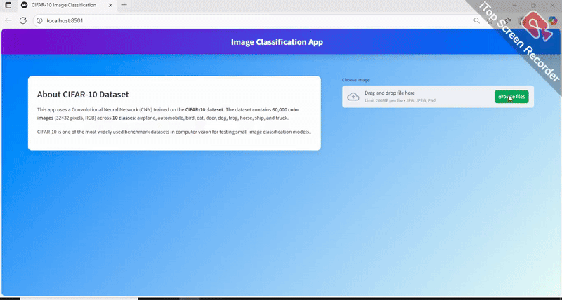

## 🎥 Demo

##  🧠 Model
The classifier is powered by a **Deep Convolutional Neural Network (CNN)** trained on the **CIFAR-10 dataset** using TensorFlow/Keras.

- 3 convolutional blocks (Conv2D + BatchNorm + MaxPooling + Dropout)
- Fully connected dense layer with 256 units + Dropout
- Final softmax layer for 10 classes
- Optimizer: Adam
- Loss: Categorical Crossentropy
- Training included **data augmentation** (rotation, shifts, flips) to improve accuracy

The trained model is saved as `model_cnn_cifar10.h5` and loaded into the Streamlit app for real-time predictions.
